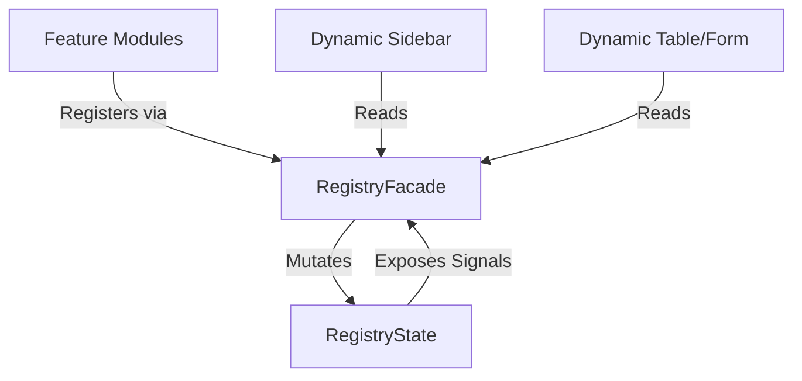
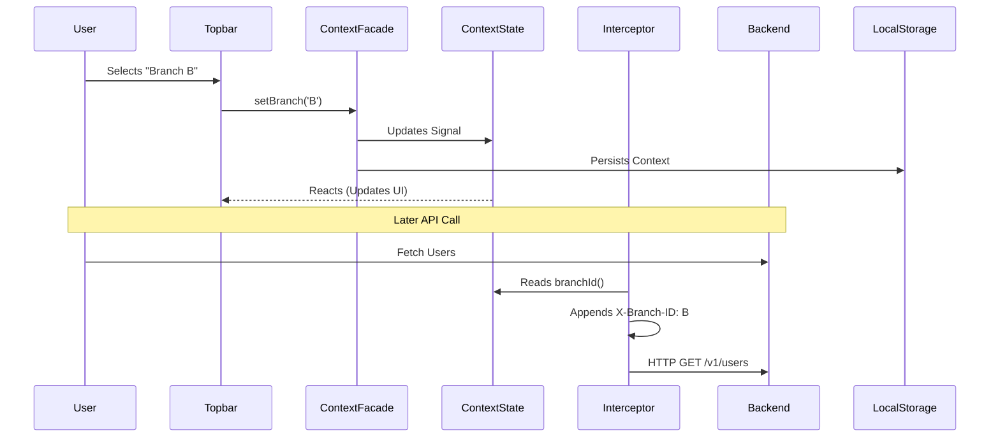

# Phase 1: Detailed Implementation Design

This document details the engineering blueprint for Phase 1 of the iDoo ERP Frontend Architecture. It focuses purely on the structural and abstract design of the Metadata Registry, Entity Registry, and MultiTenant Context Framework.

## 1. Metadata Registry & Entity Registry

The Metadata Registry handles module-level definitions (navigation, general module settings), while the Entity Registry handles specific entity configurations (Forms, Tables, API paths, permissions). Together, they allow dynamic features to register their capabilities without hardcoded imports.

### Folder Structure
```text
src/app/core/registry/
├── models/
│   ├── registry.models.ts        # Interfaces for ModuleConfig and EntityConfig
│   └── registry-events.models.ts # Event definitions
├── state/
│   └── registry.state.ts         # Signal-backed stores
├── facades/
│   └── registry.facade.ts        # Public API
├── tokens/
│   └── registry.tokens.ts        # Injection tokens for initial payload
└── providers/
    └── registry.provider.ts      # APP_INITIALIZER for registry setup
```

### Interfaces & Models
```typescript
// registry.models.ts
export interface ModuleConfig {
  id: string;
  name: string;
  icon: string;
  routePrefix: string;
  requiredPermission?: string;
  sortOrder: number;
}

export interface EntityConfig<T = any> {
  name: string;
  apiPath: string;
  permissions: {
    create: string;
    read: string;
    update: string;
    delete: string;
  };
  formSchemaFactory?: () => FormSchema;
  tableConfigFactory?: () => TableConfig<T>;
}
```

### Stores & Signals Design
```typescript
// registry.state.ts
export class RegistryState {
  // Signals mapping ID/Name to Config
  private readonly _modules = signal<Map<string, ModuleConfig>>(new Map());
  private readonly _entities = signal<Map<string, EntityConfig>>(new Map());

  // Computed signals for readonly exposure
  public readonly modules = computed(() => Array.from(this._modules().values()));
  public readonly entities = computed(() => Array.from(this._entities().values()));
}
```

### Facades
```typescript
// registry.facade.ts
export class RegistryFacade {
  // Exposes computed arrays/maps
  readonly modules: Signal<ModuleConfig[]>;
  
  registerModule(config: ModuleConfig): void;
  registerEntity(config: EntityConfig): void;
  getEntity(name: string): EntityConfig | undefined;
}
```

### Injection Tokens & Providers
- `MODULE_CONFIG_TOKEN`: Used to inject an array of modules eagerly loaded at boot.
- `APP_INITIALIZER`: Iterates over the `MODULE_CONFIG_TOKEN` to populate the `RegistryState` during application startup.

### Registration & Initialization Flow
1. **Boot**: `APP_INITIALIZER` reads from predefined config tokens and seeds the base modules (e.g., `Auth`, `Tenants`).
2. **Lazy Loading**: When a feature (e.g., `UsersModule`) is lazy-loaded by the router, its routing file calls `RegistryFacade.registerEntity()` to register the `User` entity.
3. **Reactivity**: The UI (e.g., Sidebar) reacting to `RegistryFacade.modules` updates automatically.

### Dependency Diagram


### Extension Mechanism
A plugin or separate feature can retrieve an existing `EntityConfig` via `getEntity('User')` and mutate its `formSchemaFactory` to append custom fields before the form is ever rendered.

### Example Usage
```typescript
// users.routes.ts
export const USERS_ROUTES: Routes = [
  {
    path: '',
    component: UsersListComponent,
    providers: [
      importProvidersFrom(
        // Factory pattern allows late-binding of dependencies
        registerEntity({
          name: 'User',
          apiPath: '/v1/users',
          permissions: { ... }
        })
      )
    ]
  }
];
```

---

## 2. MultiTenant Context Framework

The MultiTenant Context Framework guarantees that all HTTP requests, data queries, and UI components are scoped securely to the active Tenant, Company, and Branch.

### Folder Structure
```text
src/app/core/context/
├── models/
│   └── context.models.ts         # WorkspaceContext interface
├── state/
│   └── context.state.ts          # Signal-backed context
├── facades/
│   └── context.facade.ts         # Public mutators & retrieval
├── interceptors/
│   └── context.interceptor.ts    # HTTP header injection
└── guards/
    └── context.guard.ts          # Route guard validating context
```

### Interfaces & Models
```typescript
export interface WorkspaceContext {
  tenantId: string | null;
  companyId: string | null;
  branchId: string | null;
}
```

### Stores & Signals Design
```typescript
export class ContextStateService {
  private readonly _state = signal<WorkspaceContext>({ tenantId: null, companyId: null, branchId: null });
  
  public readonly tenantId = computed(() => this._state().tenantId);
  public readonly companyId = computed(() => this._state().companyId);
  public readonly branchId = computed(() => this._state().branchId);
}
```

### Facades
```typescript
export class ContextFacade {
  // Public readonly Signals
  readonly currentContext: Signal<WorkspaceContext>;
  
  // Mutators
  setTenant(id: string): void;
  setCompany(id: string): void;
  setBranch(id: string): void;
  
  // Lifecycle
  restoreContext(): void;
  clearContext(): void;
}
```

### Initialization Flow
1. **Login**: User logs in. `AuthService` extracts user details and calls `ContextFacade.restoreContext()`.
2. **Persistence Check**: `ContextFacade` reads `localStorage` to find the last active `CompanyId` and `BranchId`. If valid against the user's allowed branches, it applies them to the State.
3. **HTTP Requests**: `ContextInterceptor` reads `ContextFacade.currentContext()` and attaches `X-Tenant-ID`, `X-Company-ID`, and `X-Branch-ID` headers to all subsequent `HttpClient` calls.

### Sequence Diagram


---

## 3. Framework Integrations

The true power of this architecture lies in how these frameworks intersect.

### Integration with Authentication
When the `AuthService` logs out a user, it explicitly calls `ContextFacade.clearContext()` to wipe the local workspace and `RegistryFacade.clear()` (if needed) to flush sensitive memory. During session recovery, `AuthService` ensures `ContextFacade.restoreContext()` is fired immediately after token validation.

### Integration with Permissions
`EntityConfig` mandates declaring the CRUD permission codes. The **Dynamic Table** and **Dynamic Routing** engines read these codes natively. If the user lacks the permission registered in `EntityConfig.permissions.create`, the Create button in the UI is automatically hidden via the `*hasPermission` directive without the developer manually writing an `*ngIf`.

### Integration with Dynamic Forms
When a feature requests a form, it queries `RegistryFacade.getEntity('User').formSchemaFactory()`. The schema factory evaluates the `WorkspaceContext` to determine if certain fields should be visible (e.g., hiding a "Branch" dropdown if the user is already strictly scoped to a specific Branch context).

### Integration with Dynamic Tables
The **Dynamic Table Engine** listens via `effect()` to the `ContextFacade.branchId`. If the user switches branches in the Topbar, the signal triggers the table to reset its pagination and issue a new `GET` request automatically with the new headers attached by the `ContextInterceptor`.

### Integration with Dynamic Routing
The `DynamicSidebar` uses `RegistryFacade.modules` to build the menu tree. Route guards (like `TenantGuard`) read `ContextFacade.tenantId()` to block access to protected URLs if the context has not been selected yet, rerouting the user to a "Select Workspace" screen.
